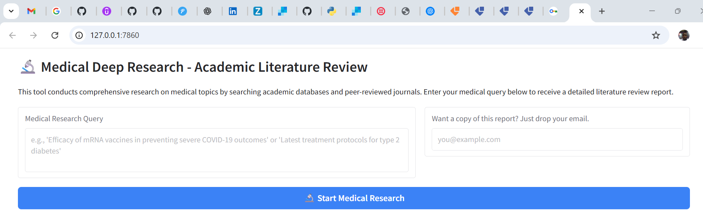
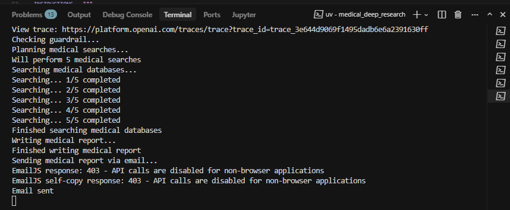
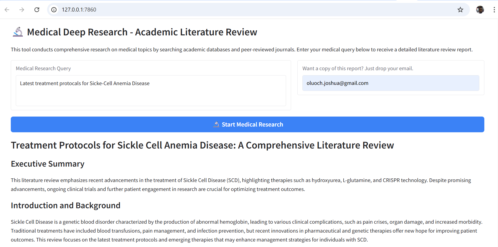

# 🔬 Medical Deep Research - Academic Literature Review

A specialized AI-powered research tool that conducts comprehensive medical literature reviews by searching academic databases and peer-reviewed journals. Built using OpenAI's Agent framework with multi-agent orchestration, guardrails, and automated email delivery.

## Overview

This tool automates the process of medical literature research by:
- **Planning** targeted academic searches using medical terminology
- **Searching** peer-reviewed papers from databases like Semantic Scholar (PubMed, MEDLINE, etc.)
- **Synthesizing** findings into comprehensive academic reports with proper citations
- **Delivering** reports via email using EmailJS

Perfect for healthcare professionals, researchers, medical students, and anyone needing evidence-based medical research synthesis.

## Key Features

### 🛡️ Medical Guardrails
- **Automatic query validation** - Only processes medical/health-related queries
- **Early rejection** of non-medical topics to save resources
- **Helpful guidance** with examples of acceptable queries

### 📚 Academic Focus
- Searches **peer-reviewed journals** and medical databases
- Uses **medical terminology** and **MeSH terms** for precise searches
- Focuses on **clinical studies**, **RCTs**, **meta-analyses**, and **systematic reviews**

### 📊 Comprehensive Reports
- **Academic-style formatting** with proper structure
- **Citations included** for all referenced papers
- **Study type identification** (RCT, observational, meta-analysis, etc.)
- **Clinical implications** and recommendations
- **5-10 pages** of detailed content (1500+ words)

### 📧 Automated Delivery
- **EmailJS integration** for report delivery
- **Optional email input** in the UI
- **Self-copy functionality** for tracking

### 🔍 Multi-Agent Architecture
- **Guardrail Agent** - Validates query relevance
- **Planner Agent** - Creates strategic search plans
- **Search Agent** - Retrieves academic papers
- **Writer Agent** - Synthesizes comprehensive reports
- **Email Agent** - Formats and sends reports

## Screenshots

### Landing Page

*The main interface with medical research query input and optional email field*

### Query Processing

*Real-time status updates showing guardrail check, planning, searching, and writing phases*

### Medical Literature Review Report

*Example of a comprehensive medical literature review with citations and academic formatting*

### Guardrail Rejection

*Example of non-medical query being rejected with helpful guidance*

## Architecture

### Agent Workflow

```
User Query
    ↓
🛡️ Guardrail Agent (Validates medical relevance)
    ↓
📋 Planner Agent (Creates 5 search queries)
    ↓
🔍 Search Agent × 5 (Searches academic databases)
    ↓
✍️ Writer Agent (Synthesizes comprehensive report)
    ↓
📧 Email Agent (Sends formatted report)
    ↓
✅ Complete
```

### Components

1. **`medical_guardrail_agent.py`** - Validates query medical relevance
2. **`medical_paper_planner_agent.py`** - Plans strategic academic searches
3. **`medical_paper_search_agent.py`** - Searches Semantic Scholar API for papers
4. **`medical_report_writer_agent.py`** - Writes academic-style literature reviews
5. **`medical_research_manager.py`** - Orchestrates the entire workflow
6. **`email_agent.py`** - Handles EmailJS integration for report delivery
7. **`medical_deep_research.py`** - Gradio UI application

## Setup Instructions

### Prerequisites

- Python 3.8+
- OpenAI API key
- EmailJS account (for email delivery)

### Installation

1. **Navigate to the project directory:**
   ```bash
   cd 2_openai/community_contributions/medical_deep_research
   ```

2. **Install dependencies:**
   ```bash
   pip install openai python-dotenv gradio requests pydantic
   ```

3. **Set up environment variables** in your `.env` file:
   ```bash
   # Required
   OPENAI_API_KEY=your_openai_api_key_here
   EJS_PUBLIC_KEY=your_emailjs_public_key
   EJS_SERVICE_ID=your_emailjs_service_id
   EJS_TEMPLATE_ID=your_emailjs_template_id
   
   # Optional
   EJS_SELF_EMAIL=your_email@example.com  # For self-copies
   ```

4. **Configure EmailJS:**
   - Create an EmailJS account at [emailjs.com](https://www.emailjs.com)
   - Set up an email service (Gmail, etc.)
   - Create an email template with variables: `{{email}}`, `{{subject}}`, `{{content}}`
   - Copy your Public Key, Service ID, and Template ID

### Running the Application

```bash
python medical_deep_research.py
```

Or with uv:
```bash
uv run python medical_deep_research.py
```

The application will start on `http://127.0.0.1:7860`

## Usage Examples

### ✅ Acceptable Medical Queries

- "Efficacy of mRNA vaccines in preventing severe COVID-19 outcomes"
- "Latest treatment protocols for type 2 diabetes"
- "Impact of sleep deprivation on cognitive function"
- "Comparative effectiveness of antidepressants in major depressive disorder"
- "Risk factors for cardiovascular disease in young adults"
- "Post-operative pain management strategies"

### ❌ Non-Medical Queries (Will be Rejected)

- "Latest trends in Python programming"
- "Best practices for marketing strategies"
- "How to invest in cryptocurrency"
- "Movie reviews from 2024"

## How It Works

### 1. Guardrail Check
The guardrail agent evaluates if the query is medical/health-related. Non-medical queries are rejected early with helpful guidance.

### 2. Search Planning
The planner agent creates 5 strategic search queries using:
- Medical terminology and MeSH terms
- Different study types (RCT, meta-analysis, etc.)
- Various aspects of the topic (mechanisms, outcomes, treatments)

### 3. Academic Paper Search
The search agent queries Semantic Scholar API (covering PubMed, MEDLINE, etc.) for:
- Peer-reviewed papers
- Journal articles
- Clinical studies
- Research publications

### 4. Report Synthesis
The writer agent synthesizes all findings into a comprehensive academic report with:
- Executive summary
- Introduction and background
- Methodology
- Key findings organized by themes
- Discussion and clinical implications
- Conclusions and recommendations
- Proper citations

### 5. Email Delivery
The email agent formats the report as HTML and sends it via EmailJS to:
- The user's email (if provided)
- A self-copy (if configured)

## Technical Details

### Models Used
- **OpenAI GPT-4o-mini** - For all agent operations (planning, searching, writing, evaluation)

### APIs Used
- **OpenAI API** - Agent orchestration and LLM calls
- **Semantic Scholar API** - Academic paper search (free, no API key required)
- **EmailJS API** - Email delivery

### Data Sources
- Semantic Scholar (covers PubMed, MEDLINE, arXiv, and more)
- Peer-reviewed journals and medical databases
- Clinical trial databases
- Medical research publications

## Limitations

- **Knowledge base scope**: Limited to publicly available papers indexed by Semantic Scholar
- **Processing time**: Full research process takes 2-5 minutes depending on query complexity
- **API rate limits**: Subject to OpenAI and Semantic Scholar rate limits
- **Language**: Currently optimized for English-language medical literature
- **No real-time access**: Cannot access paywalled journals or recent publications not yet indexed

## Future Enhancements

- [ ] Support for PubMed direct API integration
- [ ] Citation extraction and bibliography generation
- [ ] PDF paper access and full-text analysis
- [ ] Multi-language support
- [ ] Customizable report templates
- [ ] Export to PDF/Word formats
- [ ] Integration with reference management tools (Zotero, Mendeley)
- [ ] Advanced filtering (publication date, study type, impact factor)

## Lessons Learned

### Main Lesson: Multi-Agent AI Systems
Building an **agentic AI system** where multiple specialized agents collaborate to solve complex tasks demonstrates the power of:
- **Agent orchestration** - Coordinating specialized agents for different tasks
- **Guardrails** - Early validation to prevent wasted resources
- **Structured outputs** - Using Pydantic models for reliable data flow
- **Asynchronous processing** - Efficient parallel search operations

### Technical Insights
- **Semantic Scholar API** provides excellent coverage of medical literature without requiring API keys
- **Guardrails are essential** for domain-specific tools to maintain focus and quality
- **Multi-agent workflows** enable complex research tasks that would be difficult with a single agent
- **Structured outputs** ensure reliable data passing between agents

## Acknowledgments

Built as part of the Andela Gen AI Learning course, inspired by the instructor's deep research project and adapted specifically for medical/academic research.

## License

This project is part of an educational course and is intended for learning purposes.

---

**Note**: This tool is designed for research and educational purposes. It should not be used as a substitute for professional medical advice, diagnosis, or treatment.

