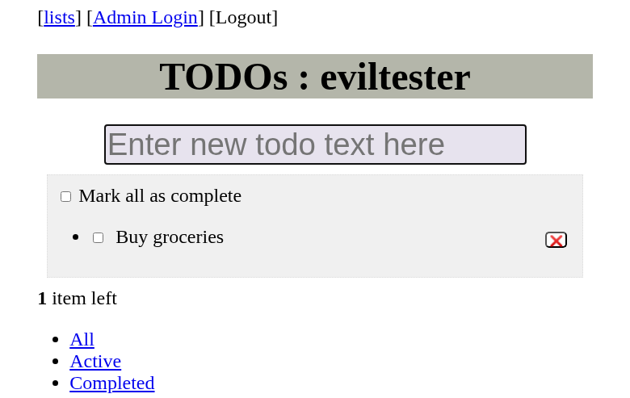

# BDD Agent System with MCP Servers

An autonomous AI agent that executes Behavior-Driven Development (BDD) tests written in Gherkin format using Model Context Protocol (MCP) servers for browser automation, assertions, and file system operations.

## 🎯 Overview

This system uses an OpenAI agent that autonomously:
- Parses Gherkin feature files
- Executes test scenarios step-by-step
- Uses MCP servers for browser automation (Playwright), assertions, and file operations
- Captures screenshots at key points
- Generates detailed test reports

## 🏗️ Architecture

```
┌─────────────────────────────────────────┐
│    OpenAI Agent (Autonomous)            │
│    - Parses Gherkin                     │
│    - Orchestrates execution             │
│    - Generates reports                  │
└────────────┬────────────────────────────┘
             │
     ┌───────┴────────┬──────────┐
     ↓                ↓          ↓
┌──────────┐   ┌───────────┐  ┌──────────┐
│Playwright│   │ Assertion │  │   File   │
│   MCP    │   │    MCP    │  │  System  │
└──────────┘   └───────────┘  └──────────┘
```

## Test File: prompt/bdd_prompt2.feature
```
Feature: Todo App Management
  As a user
  I want to manage my todo items
  So that I can track my tasks
  
  Background:
    Given I navigate to "https://eviltester.github.io/simpletodolist/todo.html"
    And I wait 2 seconds for the page to load


  Scenario: Add a new todo item
    When I type the input field "Enter new todo text here" with text "Buy groceries" - hint: use browser_type tool
    And I press the "Enter" key
    Then I should see text "Buy groceries" on the page
    And the todo list should contain at least 1 item
```

## 📊 Test Reports

The agent generates detailed JSON reports:  test-results/reports/Todo_App_Management_20251027_195007_report.json
```
{
  "feature": "Todo App Management",
  "created_at": "2025-10-27 19:34:51",
  "scenarios": [
    {
      "scenario": "Add a new todo item",
      "result": "passed",
      "assertions": [
        {
          "type": "assert_equals",
          "actual": "Buy groceries",
          "expected": "Buy groceries",
          "message": "The new todo should be visible on the page."
        },
        {
          "type": "assert_count",
          "actual": 1,
          "expected": 1,
          "message": "The todo list should contain exactly 1 item."
        }
      ],
      "screenshots": [
        "Add_a_new_todo_item_start.png",
        "Add_a_new_todo_item_end.png",
        "Add_a_new_todo_item_assertion_end.png"
      ]
    }
  ]
}
```
- Screenshots:  under test-results/screenshots.
  

## 🔧 MCP Servers

### 1. Playwright MCP Server (Browser Automation)
Official Microsoft implementation for browser automation.

### 2. Assertion MCP Server (Custom)
Custom-built server for test assertions.

### 3. Filesystem MCP Server
Official Anthropic server for file operations.

## ⚠️ Important Considerations & Limitations

1. **High Token Usage & Cost**
  - Each BDD test execution consumes significant tokens (system prompt + tool descriptions + conversation)
  - Rate limits can be hit quickly with frequent test runs

2. **Data Privacy & Security**
  - All test data, URLs, and application interactions are sent to OpenAI servers
  - Sensitive information (credentials, internal URLs, business logic) may be exposed
   
### ✅ Recommended Solution: Self-Hosted Open Source LLM

To address cost and security concerns, I **strongly recommend** deploying a dedicated server with open-source LLMs: such as Llama, DeepSeek
